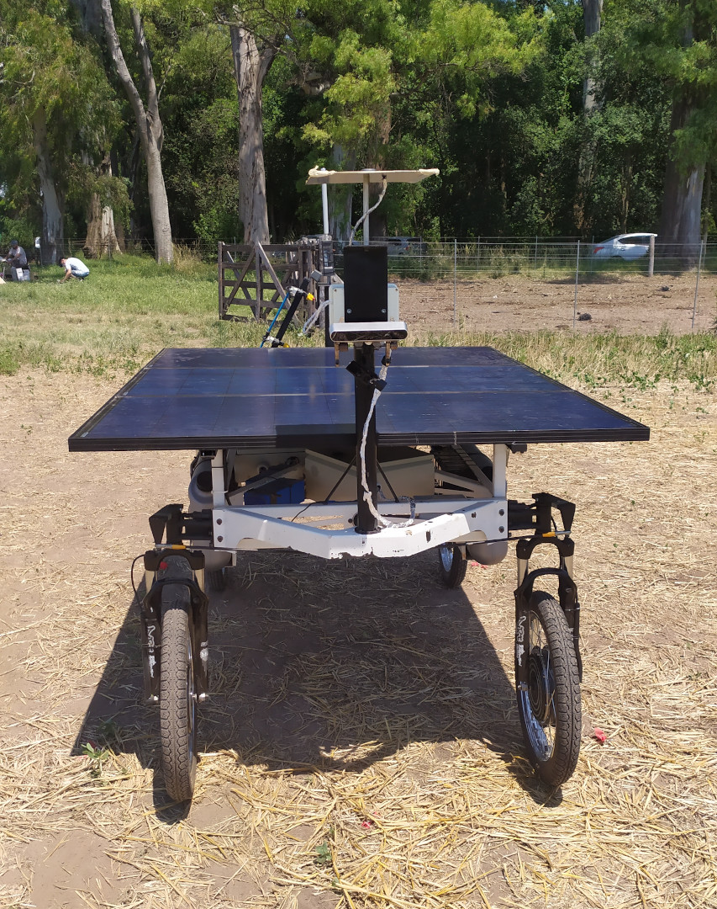
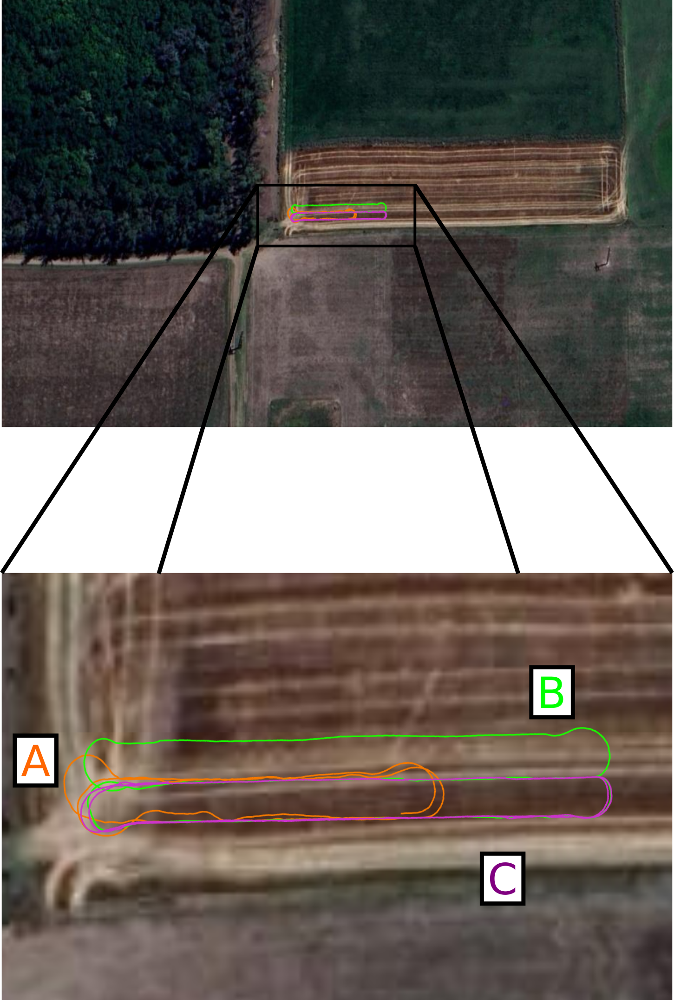
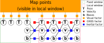

# GNSS-Stereo-Inertial Fusion

GNSS-SI (GNSS-Stereo-Inertial) fuses, in a tightly-coupled
manner, GNSS measurements into the stereo-inertial [ORB-SLAM3](https://github.com/UZ-SLAMLab/ORB_SLAM3) pipeline. For more information about ORB-SLAM3, just check its original [README](OS3_README.md).

<!-- Two images side by side with spacing -->
<div style="display: flex; justify-content: space-between;">
    
    
</div>

<!-- Vertical space -->
<br>

<!-- One image in a row below -->
<div style="text-align: center;">
    
</div>

## Video
[](https://www.youtube.com/watch?v=o7Reosq9E0o)

## Related publication
If you use this in some academic work, please cite the related publication:

J. Cremona, J. Civera, E. Kofman, T. Pire, **GNSS-stereo-inertial SLAM for arable farming**. Journal of Field Robotics, 2023. DOI: https://doi.org/10.1002/rob.22232

```bibtex
@article{cremona2023gnss,
author = {Cremona, Javier and Civera, Javier and Kofman, Ernesto and Pire, Taihú},
title = {GNSS-stereo-inertial SLAM for arable farming},
journal = {Journal of Field Robotics},
volume = {n/a},
number = {n/a},
pages = {},
keywords = {agricultural robotics, GNSS-stereo-inertial SLAM, precision agriculture},
doi = {https://doi.org/10.1002/rob.22232},
url = {https://onlinelibrary.wiley.com/doi/abs/10.1002/rob.22232},
eprint = {https://onlinelibrary.wiley.com/doi/pdf/10.1002/rob.22232}
}
```

## License
This work is licensed [GPLv3 license](LICENSE). For a list of all code/library dependencies (and associated licenses), please see [Dependencies.md](Dependencies.md).

# Installation
_Extracted from [ORB-SLAM3 README](OS3_README.md)_. 

### Prerequisites
We have tested the library in **Ubuntu 20.04**, but it should be easy to compile in other platforms. A powerful computer (e.g. i7) will ensure real-time performance and provide more stable and accurate results.

#### C++11 or C++0x Compiler
We use the new thread and chrono functionalities of C++11.

#### Pangolin
We use [Pangolin](https://github.com/stevenlovegrove/Pangolin) for visualization and user interface. Dowload and install instructions can be found at: https://github.com/stevenlovegrove/Pangolin.

#### OpenCV
We use [OpenCV](http://opencv.org) to manipulate images and features. Dowload and install instructions can be found at: http://opencv.org. **Tested with OpenCV 4.2.0 and 4.4.0**.

#### Eigen3
Required by g2o (see below). Download and install instructions can be found at: http://eigen.tuxfamily.org. **Required at least 3.1.0**.

#### DBoW2 and g2o (Included in Thirdparty folder)
We use modified versions of the [DBoW2](https://github.com/dorian3d/DBoW2) library to perform place recognition and [g2o](https://github.com/RainerKuemmerle/g2o) library to perform non-linear optimizations. Both modified libraries (which are BSD) are included in the *Thirdparty* folder.

#### GeographicLib
Required to convert GNSS measurements (latitude, longitude, altitude) to local cartesian coordinates. See [GeographicLib](https://geographiclib.sourceforge.io/).

#### Python
Required to calculate the alignment of the trajectory with the ground truth. **Required Numpy module**.

#### ROS 
Tested with ROS Noetic under Ubuntu 20.04.

## Building library and ROS Node
We provide a script `build.sh` to build the *Thirdparty* libraries and our library. Please make sure you have installed all required dependencies (see section 2). Execute:
```
chmod +x build.sh
./build.sh
```

#### ROS Node
Tested with ROS Noetic and Ubuntu 20.04.

1. Add the path including *Examples/ROS/ORB_SLAM3* to the ROS_PACKAGE_PATH environment variable. Open .bashrc file:
  ```
  gedit ~/.bashrc
  ```
and add at the end the following line. Replace PATH by the folder where you cloned gnss-stereo-inertial-fusion:

  ```
  export ROS_PACKAGE_PATH=${ROS_PACKAGE_PATH}:PATH/gnss-stereo-inertial-fusion/Examples/ROS
  ```
  
2. Execute `build_ros.sh` script:

  ```
  chmod +x build_ros.sh
  ./build_ros.sh
  ```


# Examples

Run the system:
```
./run.sh -s <YAML_CONFIG_FILE> -l <LAUNCH_FILE> <ROSBAG_FILE>
```


## Rosario Dataset
To evaluate the system using the Rosario Dataset, just run:

```
./run.sh -s Examples/Stereo-Inertial/rosario_dataset/Rosario_3_0.yaml -l Examples/ROS/ORB_SLAM3/launch/rosario.launch sequence01.bag
```

# Yaml Configuration File
Some new options were added with respect to ORB-SLAM3:

* `System.UseGlobalMeas`: `1` to use GNSS measurements, `0` to deactivate. Default: `0`
* `System.GPSSimulatedNoise`: you can add Gaussian noise to GNSS measurements. This value represents the std deviation of the zero-mean Gaussian distribution. The covariance matrix is defined as a diagonal matrix, and the elements in the diagonal are `sigma = std_dev^2`. When this value is `0`, the original measurement is used (with the original covariance matrix).
* `System.t_b_g`: 3D vector, it represents the position of the GPS antenna in the body frame.

Example:
```
System.UseGlobalMeas: 1
System.GPSSimulatedNoise: 0.5
System.t_b_g: !!opencv-matrix
   rows: 3
   cols: 1
   dt: f
   data: [0.49183,
          0.01953,
          -0.33484]
```

# Recent Modifications
Source code has been modified respect to the version used to make experiments for the paper. See [CHANGELOG](Changelog.md).
